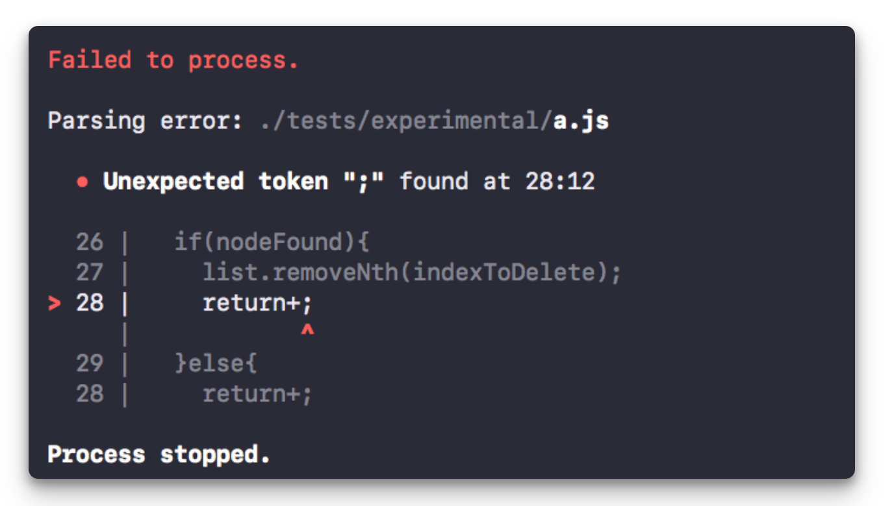

# Infrared <a href="#"></a> <a href="#"></a> <a href="#"></a>

> Blazing fast, light-weight, inferred static type checker for JavaScript.

Infared is a [static analysis tool](https://stackoverflow.com/questions/49716/what-is-static-code-analysis) that eliminates 99% of [runtime type errors](https://techterms.com/definition/runtime_error). This is done by statically inferring a [fluid type system](#) onto your program, and identifying any potential type errors that can occur, before they happen.


## FAQ

**Q** – Can I use this?

**A** – Not yet. This project is still under development, but expect an alpha release soon(_ish_)!

<!--

Infrared is a [static analysis tool](https://stackoverflow.com/questions/49716/what-is-static-code-analysis) that exposes useful things about your JavaScript programs. We tell you about things like [type inconsistencies](#), [implicit coercions](#), ['undefined is not a function'](#), [infinite loops](#), [unreachable code](#), [potential optimizations](#), and much more, before they happen.

All this **without touching your source code**, **without creating another configuration file**, and **with blazing fast speed**.

## Why Would I Use This?

> What does this do for you.

Infrared is like your JavaScript assistant. It takes a look at your program and tells you everything you need to know as a developer. This can be anything from avoiding errors, potential optimization opportunities, or just general things that you should watch out for.

While there are a good amount of reasons to use Infrared, there's no reason to _not_ use it. There's no configuration, no annotating or editing your existing files, and basically no set up or change to your existing workflow required to start using Infrared (besides installing it, of course).

It can provide a lot of benefits with almost no effort whatsoever, so why not? :stuck_out_tongue:



## How Does It Work?

> What's happening under the hood.

In order to understand your program and interpret as much context as possible, Infrared makes a few opinionated design choices. Overall, there are two core steps that happen:

#### 1. Infer a "Static" Type System

This means we assign types to your variables based on how they're first used. We don't hold this against you, JavaScript is a dynamic language and it should stay that way. We just track how you're using the variables, how often you're coercing its type, and if you're implicitly coercing its type in a spot that might be unintended or potentially problematic.

This is just a step to help us better understand the context of your program. Just wanna reiterate that nobody is trying to make you program without mutation — this just helps us see if you might want to avoid mutation in some contexts. :smile:

#### 2. Analyze &

TODO

## Installation

> Getting you up and running in no time.

The best way to get started with Infrared is to install the binary wrapper globally — this will handle everything for you.

```
npm i infrared-bin -g
```

Then you should be able to use `infrared` anywhere.

## Usage

> How do I use this shit.

Infrared's public API is very simple.

For single files, simply pass the file path to the command.
```bash
infrared file.js
```

For specific multiple files, you can pass them all at once.
```bash
infrared file1.js file2.js file3.js
```

For entire projects or directories, just pass the source path.
```bash
infrared ./src
```

All the files will be processed and analyzed — it's that easy!


## Contributing

> Getting into the swing of things.

We have a few tools that help with the development process.

Infrared is broken down into a few main parts:

 - [`infrared-bin`](#) — The binary wrapper, basically just a little CLI tool that reads a bunch of file names and hands it off.
 - [`shift-parser`](#) — Processes all those files, generates Shift parsetrees, creates a temp cache, calls `infrared-core`'s check-cache routine with the parsetree JSON files.
 - [`infrared-core`](#) - Encodes Shift parsetree JSON into Yojson OCaml AST, encodes into Infrared OCaml AST, resolves dependency graph (basic topological sort + Infrared AST optimized import/export representation), infers static type system, continue with rest of code analysis.

-->

## License

> Just do your thing, I'm not gonna sue you.

This software is free to use under the MIT License. See [this reference](https://opensource.org/licenses/MIT) for license text and copyright information.
